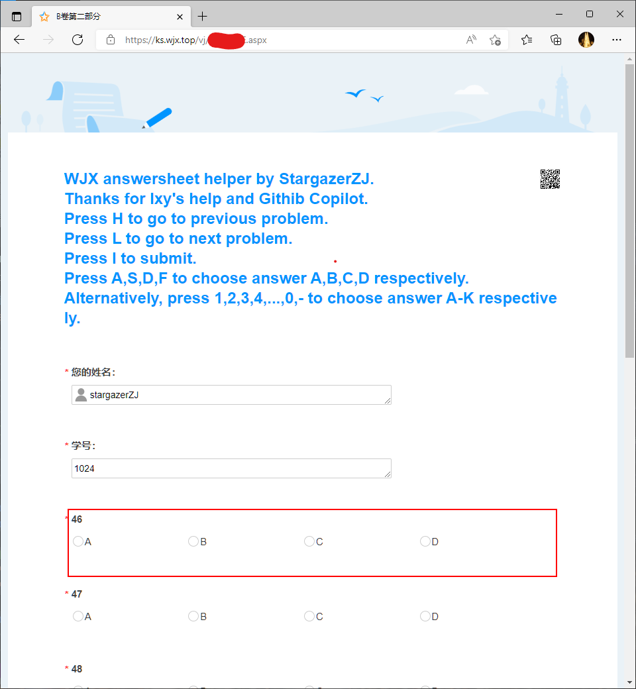

# WJX answersheet helper 使用说明

WJX answersheet helper by StargazerZJ. Thanks for lxy's help and Githib Copilot. Press H to go to previous problem. Press L to go to next problem. Press I to submit. Press A,S,D,F to choose answer A,B,C,D respectively. Alternatively, press 1,2,3,4,...,0,- to choose answer A-K respectively.

## 1. 基本使用

1. 打开问卷星提交网页。**必须是wjx问卷星才行，wenjuan问卷网不支持！**

2. 按`Shift+Ctrl+I`打开开发者工具。

3. 用**记事本**打开`WJX answersheet helper.js`，全选复制其中的内容。_不可以_直接鼠标双击这份文件。

4. 在“控制台”输入`WJX answersheet helper.js`中的内容。记得按回车。如果对这一步骤有疑问，可以参考[百度知道](https://jingyan.baidu.com/article/851fbc37b9da343e1e15ab63.html)。

5. 关闭开发者工具。

6. 若问卷的标题变为使用说明（如图），则表示脚本可能成功导入了。

7. 用键盘控制答题，参照上面的按键说明。目前支持单选题和多选题，选项需在`A-K`范围内。

8. 推荐将左手四指放在`ASDF`按键上，右手放在`HJKL`上，熟练后可以大幅提高输入速度。

9. 按下相应按键后，应该看到某道题被选择，并且页面滚动到相应位置。

## 2. 进阶使用

通过编辑位于代码前半部分的常量：

- 可以根据`ASCII`码修改按键作用
- 将姓名学号改成你自己的。自动填写姓名学号目前处于测试阶段，可能会填串。

利用`Tampermonkey`插件，在问卷星网页上自动加载脚本。由于谷歌家的Chrome上安装插件在网络上较为困难，想尝试的可以再来找我。其他常用浏览器也可以安装这个插件，且较为容易。

-----

## 警告

在不清楚开发者工具的用途时，以本使用说明的指导不同的方式点击开发者工具中的按键，可能造成浏览器崩溃。